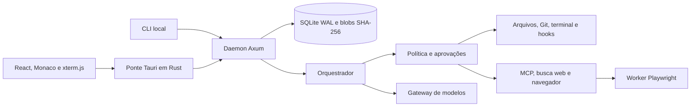

# Arquitetura

## Visão geral

O FORJA separa a interface desktop, a ponte privilegiada e o processo de orquestração. Essa separação mantém o token do daemon fora do JavaScript da página e permite que uma execução continue quando a janela fecha.

### Componentes

| Componente | Local | Responsabilidade |
| --- | --- | --- |
| Interface | `apps/desktop/src` | Início, IDE, chat técnico, editores, planos, agentes e configurações |
| Ponte Tauri | `apps/desktop/src-tauri` | Descobrir/iniciar o daemon e intermediar apenas chamadas `/v1` autorizadas |
| Daemon | `crates/daemon` | API local, autenticação, lifecycle, terminais e composição dos serviços |
| Núcleo | `crates/core` | Persistência, política, agente, modelos, contexto, planos, browser, MCP e LSP |
| CLI | `apps/cli` | Saúde, verificação de backup e restauração fora do daemon |
| Browser worker | `apps/browser-worker` | Automação Playwright em processo separado e contexto efêmero |

## Transporte local

O daemon escuta em uma porta aleatória de loopback e grava `%LOCALAPPDATA%/Forja/daemon.json`, ou o diretório indicado por `FORJA_DATA_DIR`. O arquivo contém URL, PID, versão de protocolo e um token aleatório. A API exige `Authorization: Bearer` e valida a origem. A ponte Tauri recusa URL que não seja loopback, contenha credenciais, query ou fragmento; ela aceita somente caminhos `/v1/` e não repete automaticamente mutações.

No desenvolvimento web, o Vite oferece uma ponte equivalente. O token fica no processo do servidor Vite, não no bundle entregue ao navegador. Essa ponte existe apenas para desenvolvimento.

## Persistência e replay

O `Store` usa SQLite em WAL e uma pasta de blobs identificados por SHA-256. Documentos persistidos incluem workspaces, sessões, execuções, eventos, aprovações, perfis de modelo, contexto, planos, baselines, checkpoints, agentes, propostas de código, grants de navegador e artefatos.

Eventos recebem sequência por execução e `session_sequence` crescente dentro da conversa. A interface reconstrói a apresentação por replay; replay não executa ferramentas. Uma operação interrompida com resultado incerto precisa ser reconciliada antes de continuar.

O histórico bruto é imutável. A compactação cria um resumo e uma nova revisão de contexto. Plano ativo e último checkpoint operacional são reconstruídos diretamente da persistência e fixados em cada requisição do executor, fora do intervalo descartável da compactação.

## Modelo de execução

Uma `Session` representa a conversa de um workspace. Cada envio cria um `Run` com modo, executor, revisores, nível de raciocínio e revisão de contexto próprios. A troca Planejamento → Construir mantém a sessão e cria uma nova execução.

O ciclo do executor é inspecionar, planejar, autorizar, executar, observar, verificar e revisar. Ferramentas são schemas validados. A política considera o modo, risco, modo offline e escopo aprovado. Escrita usa hash-base, checkpoint de arquivo e substituição atômica. Comandos rodam com ambiente reduzido, timeout, saída limitada e Job Object no Windows; ainda são apresentados como **isolamento reduzido**.

No modo Planejamento, `ui.present_plan` materializa um plano estruturado em `docs/forja-plans/`. O botão **Implementar Plano** captura um baseline antes da primeira mutação, cria um checkpoint operacional e inicia Construir na mesma conversa. Cada etapa associa eventos, arquivos e validações reais ao progresso.

## Modelos e contexto

`Provider` descreve endpoint e adaptador; `ModelProfile` descreve modelo, limites, capacidades e reasoning. Chaves ficam no cofre do sistema, e o banco armazena somente uma referência interna controlada pelo daemon. Não há fallback silencioso para nuvem.

O orçamento de contexto desconta saída reservada e margem de segurança. A contagem usa endpoint oficial quando disponível e uma estimativa identificada nos demais casos. A compactação automática começa antes de exceder a janela e preserva eventos originais, operações pendentes, plano e checkpoint.

## Agentes, web e navegador

Perfis de agentes pertencem a um único workspace. Um perfil define papel, modelo, reasoning, ferramentas, escrita e budgets. Planejadores e revisores não escrevem; escritores usam worktrees quando há Git. Limites atuais: quatro tarefas ativas, dois escritores e uma inferência local simultânea.

`web.fetch` e os adaptadores de busca revalidam resolução DNS e redirecionamentos, recusam destinos privados por padrão e limitam conteúdo. O Playwright roda em processo separado, cria contexto efêmero, bloqueia downloads e exige grant de origem. Screenshots viram blobs e só são enviadas como imagem a perfis que declaram visão.

## Limites de confiança

- Conteúdo de modelo, arquivo, página, MCP, skill, hook e plugin é dado não confiável e não amplia permissões.
- O processo desktop, o daemon e o usuário do sistema compartilham a mesma autoridade local; o token protege a API de páginas e processos sem a credencial, não de malware executado como o mesmo usuário.
- Job Objects melhoram cancelamento e limpeza de descendentes, mas não contêm um executável arbitrário.
- O worker ainda não classifica semanticamente cliques que causam pagamento, publicação, upload ou alteração externa. Esses fluxos continuam fora da automação aceita.
- AppContainer para plugins, assinatura de atualização e runner remoto TLS continuam pendentes.

## Recuperação

No encerramento controlado, pausa, cancelamento, troca de modelo e antes da compactação, o orquestrador grava checkpoints. Após reinício ele carrega plano, baseline e último checkpoint, valida hashes e sinaliza efeitos incertos. O backup copia banco e blobs para uma pasta nova com manifesto SHA-256; credenciais do cofre, token do daemon e árvores completas dos projetos não são copiados.
